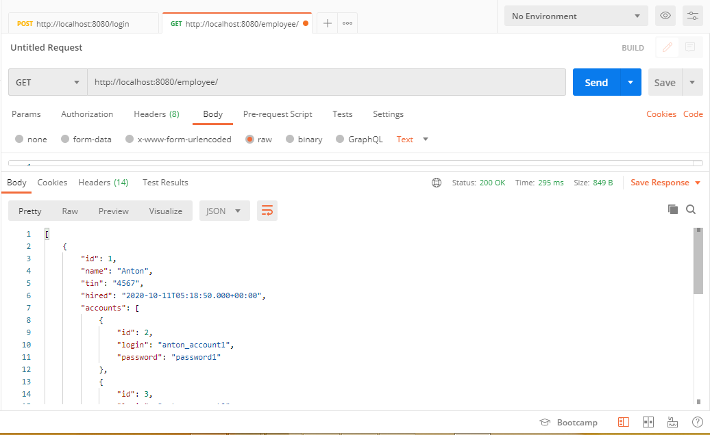
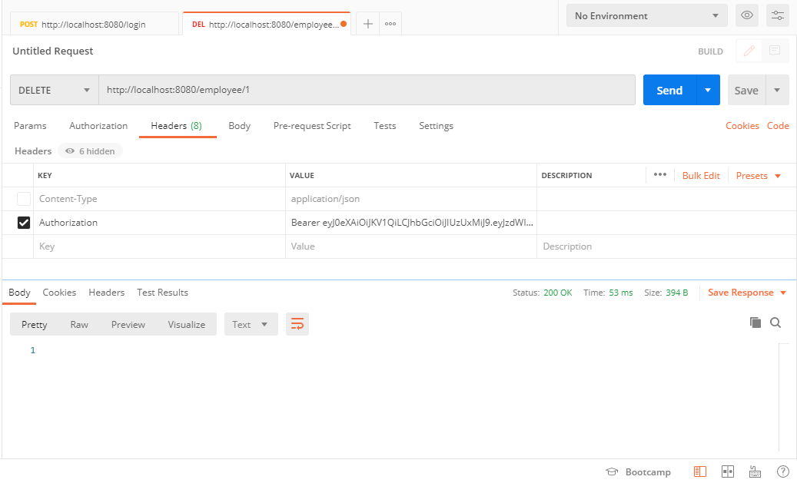

# Проект - REST

# Содержание
* [Использованные технологии](#Использованные-технологии)
* [О проекте](#О-проекте)
* [Сборка](#Сборка)
* [Использование](#Использование)
* [Контакты](#Контакты)
## Использованные технологии
* Spring Boot
* REST Services
* Интеграция REST Services через RestTemplate
* Spring Core (DI, IoC)
* Spring MVC
* Spring Test
* Spring Data JPA
* Spring Security
* Авторизация Java JWT
* Tomcat
* PostgreSQL
* JUnit 5
* Mockito
* HSQLDB
* JaCoCo
* Travis CI
* Postman
## О проекте
* Данный проект представляет собой Spring boot приложение, включающее в себя 3 REST-сервиса  
* Неавторизованные пользователи с приложением работать не могут. Чтобы послать запрос на любой из 
REST-сервисов сначала необходимо пройти авторизацию, в противном случае будет выдана ошибка доступа.  
* Авторизация построена на Java JWT. Все зарегистрированные пользователи хранятся в БД. 
Все пароли пользователей хранятся в БД в закодированном виде  
* Приложение построено на двух слоях: слой по работе с БД и слой контроллеров  
* В качестве БД используется PostgreSQL  
* Работа с БД осуществляется через Spring Data JPA  
* Слой контроллеров использует Spring MVC  
* Все контроллеры построены по REST-архитектуре  
* Осуществлена интеграция REST-сервисов через RestTemplate  
* На все контроллеры написаны тесты с помощью Spring Test, Mockito и JUnit5  
* В качестве БД для тестов используется БД в памяти HSQLDB  
* Между сущностями используется связь OneToMany  
* В качестве системы непрерывной интеграции используется Travis CI  
* Для сбора информации о покрытии кода тестами и дальнейшего её анализа используются 
JaCoCo-plugin и сервис codecov.io  
* Для проверки приложения используется программа Postman (см. пример использования в 
разделе "[Использование](#Использование)")
## Сборка
1. Установить JDK 14.
2. Скачать Maven.
3. Создать переменные окружения JAVA_HOME и M2_HOME и прописать в переменную окружения Path 
пути до бинарных файлов для JDK и для Maven:  
  
4. Установить сервер БД PostgreSQL. При установке задать: 
    * имя пользователя - postgres 
    * пароль - root
    * порт - 5432 
Также при установке сервера БД PostgreSQL нужно установить программу pg_Admin.

5. Скачать исходный код проекта с GitHub.
6. Перейти в корень проекта, где лежит файл pom.xml:  
  
  
7. С помощью Maven осуществить сборку проекта:  
  
При успешной сборке должна появиться папка target, в которой располагается jar-архив:  
  
  
  
8. Запустить сервер БД, указав путь до папки data:  
  
9. Запустить программу pg_Admin, установленную вместе с сервером БД PostgreSQL:  
  
10. Создать БД с названием fullstack_auth:  
  
11. Открыть Query Tool для созданной БД и запустить SQL-скрипт update_001.sql, 
находящийся в папке src/main/resources/db (папка src находится в корне скачанного проекта):  
  
  
Сборка завершена. Теперь можно проверить работу приложения.
## Использование
* Переходим в папку target, где располагается собранный jar-архив и запускаем Spring boot приложение:  
  
  
* Для проверки работы приложения будем использовать программу Postman, чтобы посылать соответствующие 
HTTP-запросы на REST-сервисы:  
  
* Будем посылать запросы на REST-сервис, представленный классом EmployeeController, 
чтобы проверить связь OneToMany между сущностями.  
* Сейчас в БД нет данных:  
  
  
  
* Попробуем отправить POST-запрос на REST-сервис:  
  
  
  
* Как видно в ответе мы получили ошибку 403 о запрете доступа. Это произошло потому, что мы отправили запрос 
под неавторизованным пользователем (без токена).  
* Сейчас в БД нет зарегистрированных пользователей, поэтому пройдём регистрацию, отправив следующий POST-запрос:  
  
  
  
  
* Как видно, в БД появился пользователь. Регистрация прошла успешно.  
* Теперь пройдём авторизацию (получим токен), отправив следующий POST-запрос:  
  
  
  
* Токен располагается в заголовке Authorization ответа от сервера.  
* Теперь мы можем получить доступ ко всем REST-сервисам нашего приложения, 
указывая в заголовках отправляемых запросов полученный токен.  
* Ещё раз попробуем отправить POST-запрос на REST-сервис, указав при этом полученный токен в заголовке 
с названием Authorization:  
  
  
  
  
  
  
* Как видно, POST-запрос был успешно отправлен и новый сотрудник был добавлен в БД.  
* Сделаем ещё один POST-запрос (добавим ещё одного сотрудника):  
  
  
  
  
  
  
* Теперь можно получить всех сотрудников, отправив следующий GET-запрос:  
  
  
  
  
* Получим сотрудника по id, отправив следующий GET-запрос:  
  
  
  
* Обновим сотрудника с именем Dmitry и все его аккаунты, отправив следующий PUT-запрос:  
  
  
  
  
  
  
* Удалим сотрудника с именем Anton и все его аккаунты из БД, отправив следующий DELETE-запрос:  
  
  
  
  
  
  
* На этом проверка данного REST-сервиса закончена. Аналогичным образом можно проверить и остальные REST-сервисы.
## Контакты
Почта: studentnstu97@mail.ru 
Skype: live:.cid.9cdc925fb48220b4